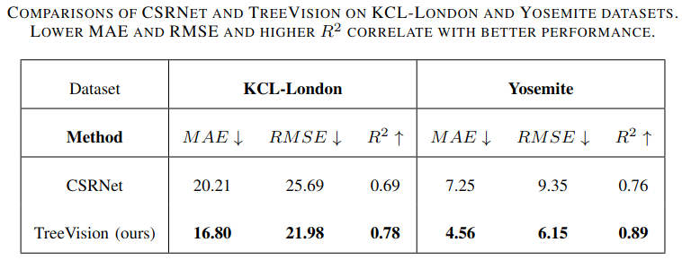

# Expanding Vision in Tree Counting: Novel Ground Truth Generation and Deep Learning Model

## Members

Minh Nhat Ton-That - 10422050@student.vgu.edu.vn

Tin Viet Le - 10422078@student.vgu.edu.vn

Nhien Hao Truong - 10422062@student.vgu.edu.vn

An Dinh Le - d0le@ucsd.edu

Anh-Duy Pham - apham@uni-osnabrueck.de

Hien Bich Vo - hien.vb@vgu.edu.vn

## Introduction
This is the code repository for the 10th IEEE INTERNATIONAL CONFERENCE ON COMMUNICATIONS AND ELECTRONICS 2024 (IEEE ICCE 2024) paper ["Expanding Vision in
Tree Counting: Novel Ground Truth Generation and Deep Learning Model"](https://ieeexplore.ieee.org/document/10634677) 

In our paper, we propose two contributions:
- A new ground truth generation practice to potentially boost the training effectiveness.
- A new tree-counting model called TreeVision with competitive performance compared with state-of-the-arts.

## Project structure
```
TreeVision Project
├───dataloaders/                 # Contains .h5 files for the KCL-London and Yosemite dataset      
|   ├───london/                     
|   |   │   ├───train_london.h5
|   │   |   └───val_london.h5
|   ├───yosemite_512_cropped/                     
|   |   │   ├───train_yosemite_1536_cropped.h5
|   │   |   └───val_yosemite_1536_cropped.h5
│   └───yosemite_512/                           
|   |   │   ├───train_yosemite_512.h5
|   │   |   └───val_yosemite_512.h5
├───datasets/                    # Contains images and labels of the KCL-London and Yosemite dataset.
|   ├───london/                     
|   |   │   ├───train/
|   |   │   |   │   ├───images
|   |   │   |   │   └───labels
|   |   │   ├───val/
|   |   │   |   │   ├───images
|   |   │   |   │   └───labels
|   |   │   └───test/
|   |   │   |   │   ├───images
|   |   │   |   │   └───labels
│   ├───yosemite_1536_no_crop/                 # The images are first cropped to size 1536x1536 according to IMAGE_PREPROCESS.md     
|   |   │   ├───zone A/           # Zone A and C are reserved for testing
|   |   │   |   │   ├───images
|   |   │   |   │   └───labels
|   |   │   ├───zone B/           # Zone B and D are reserved for training
|   |   │   |   │   ├───images
|   |   │   |   │   └───labels
|   |   │   ├───zone C/
|   |   │   |   │   ├───images
|   |   │   |   │   └───labels
|   |   │   └───zone D/
|   |   │   |   │   ├───images
|   |   │   |   │   └───labels
│   ├───yosemite_1536/                 # The images are cropped from size 1536x1536 according to IMAGE_PREPROCESS.md     
|   |   │   ├───zone A/           # Zone A and C are reserved for testing
|   |   │   |   │   ├───images
|   |   │   |   │   └───labels
|   |   │   ├───zone B/           # Zone B and D are reserved for training
|   |   │   |   │   ├───images
|   |   │   |   │   └───labels
|   |   │   ├───zone C/
|   |   │   |   │   ├───images
|   |   │   |   │   └───labels
|   |   │   └───zone D/
|   |   │   |   │   ├───images
|   |   │   |   │   └───labels
│   ├───yosemite_512/                 # The images are directly cropped to size 512x512 according to IMAGE_PREPROCESS.md     
|   |   │   ├───zone A/           # Zone A and C are reserved for testing
|   |   │   |   │   ├───images
|   |   │   |   │   └───labels
|   |   │   ├───zone B/           # Zone B and D are reserved for training
|   |   │   |   │   ├───images
|   |   │   |   │   └───labels
|   |   │   ├───zone C/
|   |   │   |   │   ├───images
|   |   │   |   │   └───labels
|   |   │   └───zone D/
|   |   │   |   │   ├───images
|   |   │   |   │   └───labels
|   └───yosemite/
|   |   │   ├───z20_data.png
|   |   │   ├───z20_label.png
├───weights/                      # Default folder to save checkpoints and the best weight after training
│   ├───CSRNet_Shanghai_B_weights.h5       # Pretrained weight of CSRNet on ShanghaiB dataset
│   ├───yosemite_512_best.pth     # Pretrained weight of TreeVision on the Yosemite dataset with images being cropped directly to size 512x512
│   ├───yosemite_1536_best.pt     # Pretrained weight of TreeVision on the Yosemite dataset with images being cropped to size 1536x1536 before applying gaussian filter
│   └───london_best.pth  # Pretrained weight of TreeVision on the KCL-London dataset
├───dataloader.py
├───IMAGE_PREPROCESS.md
├───Github_Image_Processing.ipynb
├───london.yaml
├───model_utils.py
├───model.py
├───requirements.txt
├───README.md
├───test.py
├───train.py
├───main.ipynb
├───utils.py
├───yosemite_1536.yaml
└───yosemite_512.yaml                                    
```
## Dataset
The datasets used in this paper are the [KCL-London dataset](https://drive.google.com/file/d/1xcjv8967VvvzcDM4aqAi7Corkb11T0i2/view?usp=sharing) and the [Yosemite dataset](https://github.com/nightonion/yosemite-tree-dataset).
 - **KCL-London**: 613 annotated and 308 unannotated images each having a size of 1024×1024. The dataset comprises 452 images for training and 161 images for testing, with a total of 95,067 annotated tree
 - **Yosemite**: the original image covers a 2262.5m × 4525.1m rect-
angular area in reality (19200×38400 pixels in image), captured in Yosemite National Park, California, United States of America. There are 98,949 trees labeled in total



## Environment setup
We develop our project on Google Colab platform with Python 3.10.

To set up the environment, please:
 
 1. Clone this repository
 2. Run `pip install -r requirements.txt`
 3. Download the KCL-London and Yosemite datasets, along with their corresponding .h5 files, using the provided links.
 4. Arrange the downloaded files and folders to match the specified project structure.

## Evaluation
Download our pretrained model on the [Yosemite_512](https://drive.google.com/file/d/1gEBEPHi7LhCZWbBICHuj46KJlggfVXlB/view?usp=sharing), [Yosemite_1536](https://drive.google.com/file/d/10He9U6JYtKZfz_dGUguZ_ADvSzfVroe9/view?usp=drive_link) and [KCL-London](https://drive.google.com/file/d/1-sf-ayfdpDnNZ0FOdVWTuDn_G-JDi6Y1/view?usp=sharing) datasets.

The weight of CSRNet for evaluation in this paper is the pretrained weight on Shanghai_B, which can be found in the [CSRNet original repo](https://github.com/leeyeehoo/CSRNet).

## References
If you find our research helpful, please cite our paper. Thank you!
```
@INPROCEEDINGS{10634677,
  author={Ton-That, Minh Nhat and Le, Tin Viet and Truong, Nhien Hao and Le, An Dinh and Pham, Anh-Duy and Vo, Hien Bich},
  booktitle={2024 Tenth International Conference on Communications and Electronics (ICCE)}, 
  title={Expanding Vision in Tree Counting: Novel Ground Truth Generation and Deep Learning Model}, 
  year={2024},
  volume={},
  number={},
  pages={409-414},
  keywords={Training;Deep learning;Electric potential;Computational modeling;Vegetation;Manuals;Transformers},
  doi={10.1109/ICCE62051.2024.10634677}}
```

## Acknowledgements
We extend our sincere gratitude to the following sources for their invaluable work, which has significantly supported our project.

For Yosemite tree dataset, refer to:

https://github.com/nightonion/yosemite-tree-dataset

For KCL-London tree dataset, refer to:

https://github.com/HAAClassic/TreeFormer

For information on dilated convolutional architectures and pretrained weights for dilated layers on the ShanghaiB dataset, refer to:

https://github.com/leeyeehoo/CSRNet-pytorch

For information on the Vision Transformers backbone, visit:

https://github.com/facebookresearch/detectron2/tree/main/projects/ViTDet
